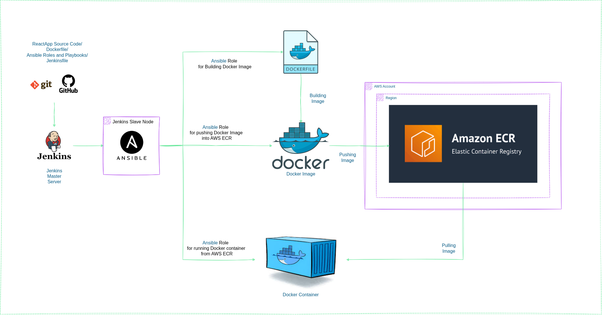

# 🚀 ReactJS App Deployment with Ansible, Docker, Jenkins, and AWS ECR

This project demonstrates the end-to-end CI/CD deployment of a **ReactJS frontend application** using GitHub, Ansible roles, Docker, AWS ECR, and Jenkins.

---

## 🧰 Technology Stack

- 💻 **Frontend**: ReactJS (code hosted on GitHub with Dockerfile)
- ⚙️ **Configuration Management**: Ansible (3 custom roles)
- 🐳 **Containerization**: Docker
- 📦 **Container Registry**: AWS Elastic Container Registry (ECR)
- 🔁 **CI/CD Pipeline**: Jenkins
- ☁️ **Infrastructure**: EC2 instance as Jenkins Slave (Ansible + Docker installed)

---

## 🧱 Architecture

> ✅ GitHub → Jenkins (Local Master) → EC2 Jenkins Slave → Ansible Roles → Docker + AWS ECR

---

## 🔧 Jenkins Setup

- Jenkins is installed on the **local machine**.
- Jenkins Slave configured using **AWS EC2**.
- EC2 Jenkins Slave has:
  - ✅ Ansible
  - ✅ Docker
  - ✅ AWS CLI
  - ✅ Required credentials and permissions

---

## 📦 Ansible Roles

This project includes **3 Ansible Roles** for complete lifecycle:

### 1️⃣ `docker_build`  
- Builds Docker image for ReactJS App.
- Uses `Dockerfile` from GitHub repo.
- Automatically tags image with the latest Git **commit ID**.

### 2️⃣ `docker_push_to_ecr`  
- Logs in to **AWS ECR** using `get-login-password`.
- Pushes the above Docker image to the specified **ECR repository**.

### 3️⃣ `docker_run_from_ecr`  
- Pulls image from **AWS ECR**.
- Runs the container with **latest tag**.
- Ensures container is **recreated** on each deployment to reflect the latest changes.

---

## 🔄 CI/CD Flow

1. 🧠 **ReactJS code + Dockerfile + Ansible Roles + Jenkinsfile** lives in GitHub repo.
2. 🕹️ Jenkins (local) triggers the job when the GitHub repo is updated.
3. 🤖 Jenkins executes pipeline on EC2 Jenkins slave:
    - 🔧 `ansible-playbook` to build an image with Git commit ID as a tag.
    - 🚀 Push Docker image to AWS ECR.
    - 🧱 Pull and run the latest container from ECR on EC2.

---

## 🧪 Jenkins Pipeline

---

## 🗂️ AWS ECR Repo Images

---

## 💻 Jenkins Slave (EC2 Setup)

---

## 📦 Running Docker Container

---

## 🌐 ReactJS App Access

---

## ✅ Key Highlights

- GitHub Codespaces used to source ReactJS application code.
- Jenkins pipeline uses `sed` to inject Git commit ID as Docker image tag.
- All stages (build, push, run) are modularized using Ansible roles.
- Docker container is always **updated**, not deleted, during new deployments.

---

## 📬 Feedback / Contributions

Feel free to fork the repo, raise issues, or contribute improvements!

---
